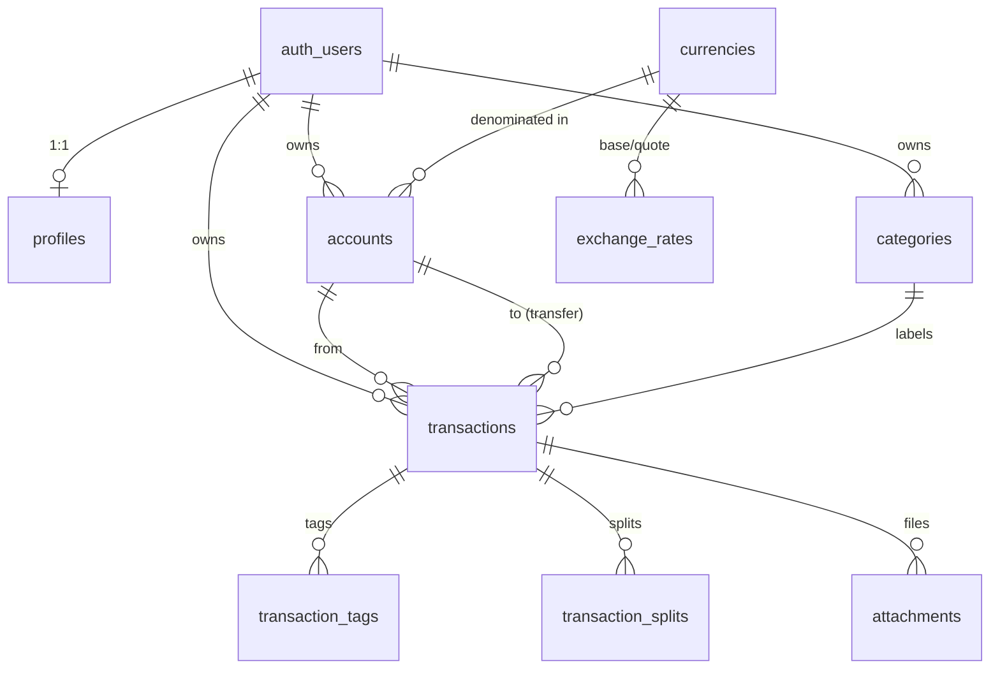

# Database

Managed Postgres on Lovable Cloud. All timestamps are `timestamptz`. All money
values are `bigint` in the currency's minor units (e.g. cents).

## ER Diagram

## Tables (v1)

| Table | Purpose |
| --- | --- |
| `profiles` | Per-user preferences: display name, base currency, locale. |
| `currencies` | Reference list (USD, EUR, GBP, INR, NPR, JPY, …). |
| `exchange_rates` | `(base, quote, rate, as_of)` unique. |
| `accounts` | Every wallet the user owns. `current_balance_minor` trigger-maintained. |
| `categories` | Income / expense taxonomy. Seeded defaults on signup. |
| `transactions` | Core ledger. Transfers use `to_account_id` + `transfer_group_id`. |
| `transaction_tags` | Composite PK `(transaction_id, tag)`. |
| `transaction_splits` | One txn split across multiple categories. |
| `attachments` | Receipt/invoice storage paths (schema only in v1). |
| `audit_logs` | Append-only user activity. |

## Balance maintenance

`tg_transactions_balance` fires `AFTER INSERT/UPDATE/DELETE` on `transactions`
and recomputes `accounts.current_balance_minor` for the affected accounts via
`recompute_account_balance(uuid)`. Opening-balance updates fire the same
recompute through `tg_accounts_opening`.

## RLS

Every user-owned table:
- `GRANT SELECT, INSERT, UPDATE, DELETE ... TO authenticated`
- `ALTER TABLE ... ENABLE ROW LEVEL SECURITY`
- Policies scoped to `auth.uid() = user_id` (or an EXISTS join for child tables).

Reference tables (`currencies`, `exchange_rates`) are readable by `anon` and `authenticated`.

`SECURITY DEFINER` internal helpers (`recompute_account_balance`,
`handle_new_user`, trigger fns) have `EXECUTE` revoked from `public/anon/authenticated`.
