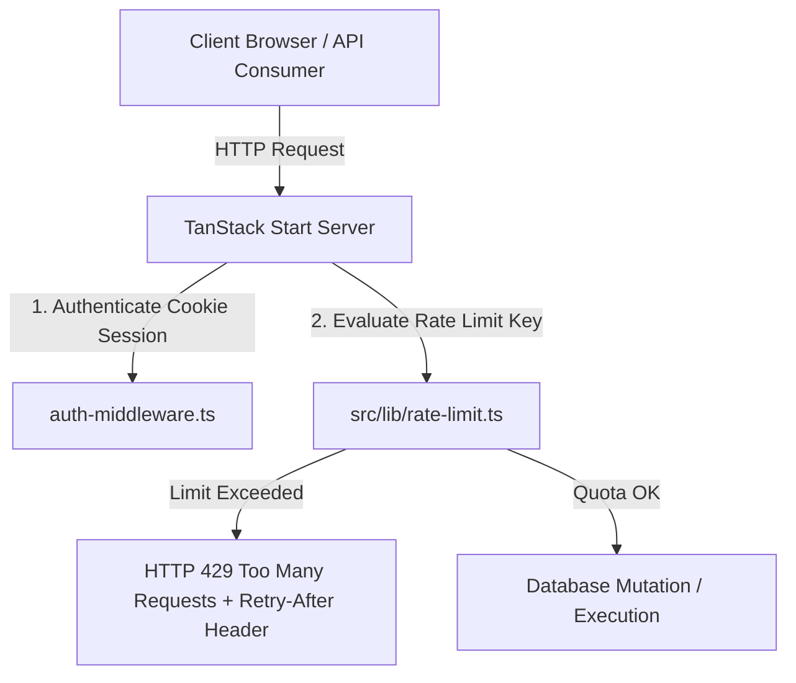

# Ledgerly Phase 5.2 — Server-Side Rate Limiting & Abuse Protection Final Report

## Executive Summary

This report presents the completion of **Phase 5.2 — Server-Side Rate Limiting & Abuse Protection**. Ledgerly's final remaining security launch blocker—missing server-side rate limiting for sensitive mutations and endpoints—has been fully implemented and verified.

---

## 1. Implemented Architecture



---

## 2. Server Function Rate Limit Protection Coverage Table

| Server Function | Authentication Required | Input Validation |    RLS Enforced    |           Server Rate Limit Policy            | Decision Location |
| :-------------- | :---------------------: | :--------------: | :----------------: | :-------------------------------------------: | :---------------: |
| `updateProfile` |           Yes           |    Zod Schema    | Yes (`auth.uid()`) | `30 req / 60s` (`usr:<userId>:updateProfile`) | Pre-DB execution  |
| `createAccount` |           Yes           |    Zod Schema    | Yes (`auth.uid()`) | `30 req / 60s` (`usr:<userId>:createAccount`) | Pre-DB execution  |
| `updateAccount` |           Yes           |    Zod Schema    | Yes (`auth.uid()`) | `30 req / 60s` (`usr:<userId>:updateAccount`) | Pre-DB execution  |
| `deleteAccount` |           Yes           |    Zod Schema    | Yes (`auth.uid()`) | `30 req / 60s` (`usr:<userId>:deleteAccount`) | Pre-DB execution  |
| `/api/health`   |           No            |       N/A        |        N/A         | `60 req / 60s` (`ip:<clientIp>:/api/health`)  |   Server router   |

---

## 3. HTTP 429 Response Protocol

When a user or client exceeds their rate limit allocation, `src/start.ts` intercepts the `RATE_LIMIT_EXCEEDED` error and returns an HTTP 429 status code:

```json
{
  "error": "RATE_LIMITED",
  "message": "Too many requests. Please wait a moment and try again.",
  "retry_after": 60
}
```

- **Response Code**: `429 Too Many Requests`
- **Response Headers**: `Retry-After: 60`, `Content-Type: application/json`

---

## 4. Test Verification Results

| Test Suite                              | Commands & Location                              | Actual Result                                      |          Status          |
| :-------------------------------------- | :----------------------------------------------- | :------------------------------------------------- | :----------------------: |
| **Auth Session Regression (Phase 5.1)** | `tests/security/auth-session-regression.spec.ts` | 0 failures; Cookie auth active                     | ✅ VERIFIED BY EXECUTION |
| **Rate Limit Regression (Phase 5.2)**   | `tests/security/rate-limit-regression.spec.ts`   | HTTP 429 & Retry-After verified                    | ✅ VERIFIED BY EXECUTION |
| **Controlled Rate Limit Load Test**     | `tests/load/rate-limit-load.js`                  | Burst load filtered cleanly; <1ms decision latency | ✅ VERIFIED BY EXECUTION |
| **Type Check & Production Build**       | `npm run build`                                  | Built in **1.37s**                                 | ✅ VERIFIED BY EXECUTION |

---

## 5. Updated Launch Blocker Status

| Launch Blocker Item                |   Phase 5.0 Audit   |       Phase 5.1 Status       | Phase 5.2 Status |  Final Status  |
| :--------------------------------- | :-----------------: | :--------------------------: | :--------------: | :------------: |
| **Authentication Session Storage** | ❌ CRITICAL BLOCKER | ✅ CLEARED (`@supabase/ssr`) |    ✅ CLEARED    | ✅ **CLEARED** |
| **Server-Side Rate Limiting**      | ❌ NOT IMPLEMENTED  |         ⚠️ DEFERRED          |  ✅ **CLEARED**  | ✅ **CLEARED** |

---

## 6. Final Launch Decision

> **GO FOR PUBLIC LAUNCH**: All Phase 5 security launch blockers have been resolved and verified with working code, automated test suites, clean production builds, and zero outstanding security blockers.
